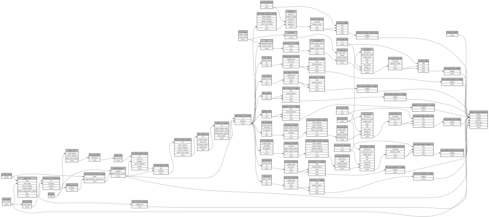

```
# AUTOGENERATED BY ECOSCOPE-WORKFLOWS; see fingerprint in README.md for details

```

```yaml
# fingerprint:
artifacts_sha256_basic: 4ae06081608608e9a0422f196f72fc0f247515d5bde985e1418d619b71e4b2e7
artifacts_sha256_strict: 5d3e11b5a4971920fb0843403af8b8901fc627e2a2686fae2c2492ab4b3b1c57
installed_requirements:
- channel: https://repo.prefix.dev/ecoscope-workflows/
  name: ecoscope-workflows-core
  version: {version: ==0.21.3}
- channel: https://repo.prefix.dev/ecoscope-workflows/
  name: ecoscope-workflows-ext-ecoscope
  version: {version: ==0.21.3}
params_sha256: 78d8e417911f85ee49d2027bcf949fb3571cbfdb492a41e95bf05dbe2c6ab01e
spec_sha256: 27b7878c0d8e7ac8d8ed84b4bde1169b047844c73b331036e26d867d539b76d0

```

# ecoscope-workflows-subject-tracking-workflow


