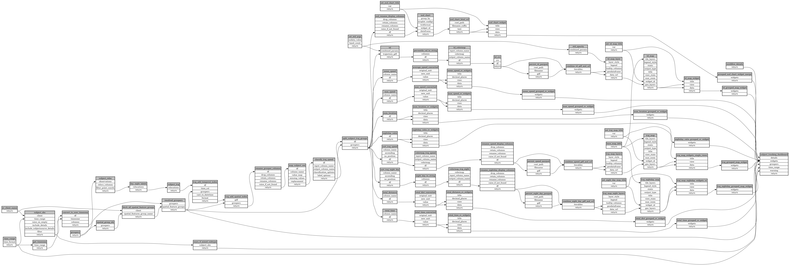

```
# AUTOGENERATED BY ECOSCOPE-WORKFLOWS; see fingerprint in README.md for details

```

```yaml
# fingerprint:
artifacts_sha256_basic: 644654df5adc661da7493a9ddc9cabe33013c66bc277ffa078f2dbe166763ef3
artifacts_sha256_strict: 3f382b1af2cad2d6a49182663d8e30b6a8fe19769f4c4eae371341ae71de99d8
installed_requirements:
- channel: https://repo.prefix.dev/ecoscope-workflows/
  name: ecoscope-platform
  version: {version: ==2.11.5}
params_sha256: e8e865ab5eda5627ac6f5006ec2047c0f9e17a1c1dbc63d134b3bb9a3cd5c5c6
spec_sha256: a83c7bf8ba327517dd4b83bf6470fae3fcd8a4472983bb15845ba948c2b07e24

```

# ecoscope-workflows-subject-tracking-workflow


