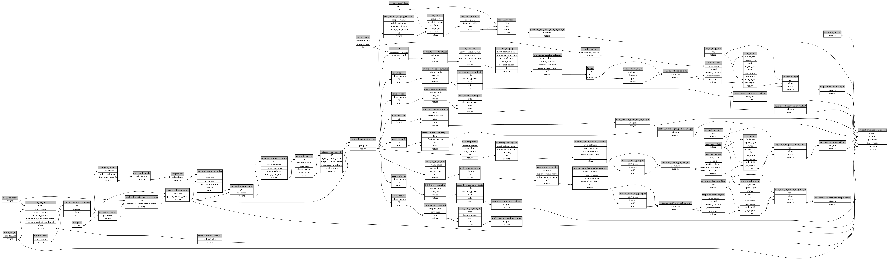

```
# AUTOGENERATED BY ECOSCOPE-WORKFLOWS; see fingerprint in README.md for details

```

```yaml
# fingerprint:
artifacts_sha256_basic: 79691a2b2b2615a790376fd743bf8e049ca1ca111cee5b1d9ff7a15f906a8639
artifacts_sha256_strict: 8b1b58ac3e6e998a43ab9ce2c69f2e53ed6698c74caec33731cbac59ac066792
installed_requirements:
- channel: https://repo.prefix.dev/ecoscope-workflows/
  name: ecoscope-platform
  version: {version: ==2.20.0}
- channel: conda-forge
  name: pydeck
  version: {version: ==0.9.2}
params_sha256: 59faf653a263ebee6357693eac081eb4ea3f617bf5fe97134728f9e46019f4fd
spec_sha256: e0329922c4fcc0904c80447a31c768ba83baa025cd8d9cea66659f3882087e8f

```

# ecoscope-workflows-subject-tracking-workflow


