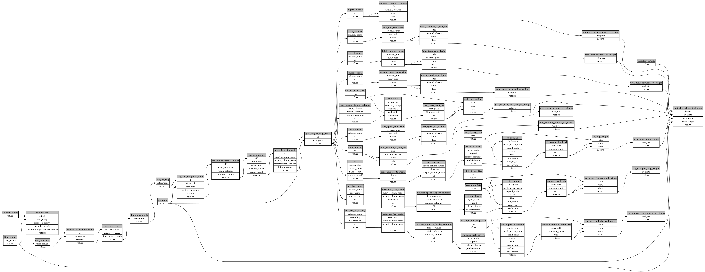

```
# AUTOGENERATED BY ECOSCOPE-WORKFLOWS; see fingerprint in README.md for details

```

```yaml
# fingerprint:
artifacts_sha256_basic: a6cb368d5b86c2108319770f77d46722472be6d83aa0ebd80193a73bc33c158a
artifacts_sha256_strict: e88ccdb356755f0d5a7508b330968235204c4cc0e01b6a1edb7566edf3ae36d0
installed_requirements:
- channel: https://repo.prefix.dev/ecoscope-workflows/
  name: ecoscope-workflows-core
  version: {version: ==0.3.8}
- channel: https://repo.prefix.dev/ecoscope-workflows/
  name: ecoscope-workflows-ext-ecoscope
  version: {version: ==0.3.8}
params_sha256: 77b2fd505097a612234ed9efa4709f860298ff9cb42749c0eca41834acaf31aa
spec_sha256: 4318197f6d64ecdfa5c9c711d888b1b2aeb6e220d373182ccf39550ec25e6120

```

# ecoscope-workflows-subject-tracking-workflow


